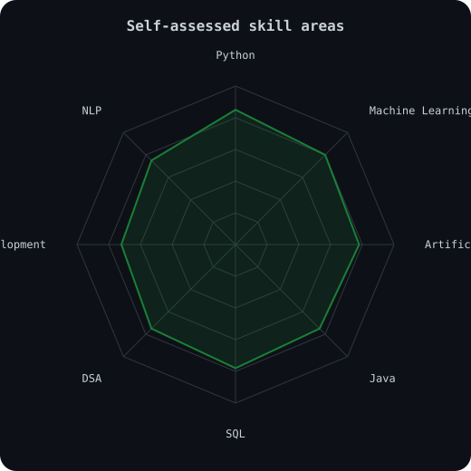
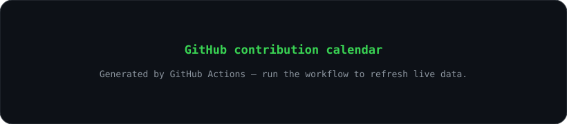
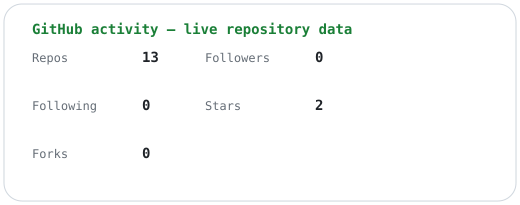
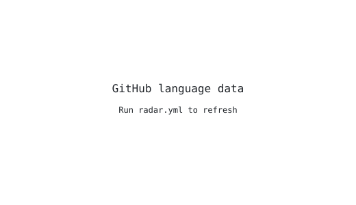
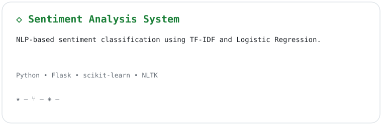
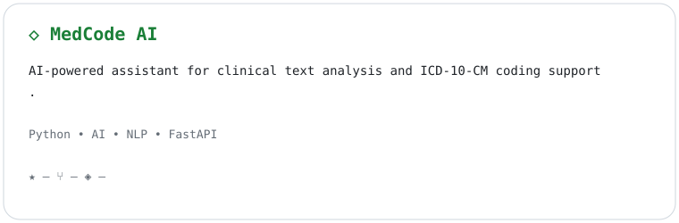
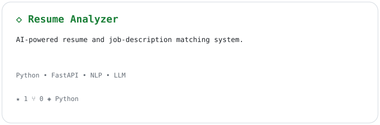
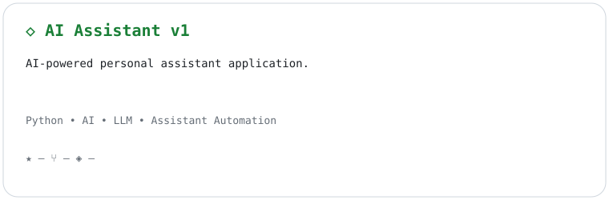
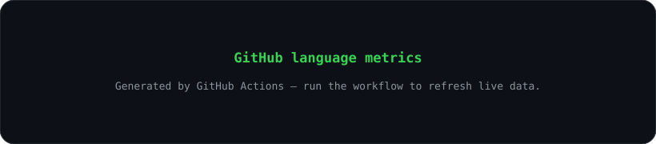
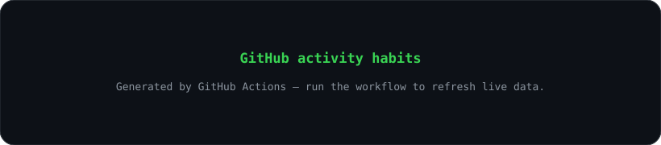

<p align="center">
  
</p>

<p align="center">
  
</p>

<p align="center"><b>Computer Science Undergraduate</b></p>
<p align="center">AI / ML • Software Development • Python • Java • SQL • DSA</p>

<p align="center">
  <a href="https://github.com/Shubhankar0199">GitHub</a> ·
  <a href="https://www.linkedin.com/in/shubhankar-pratap-singh11/">LinkedIn</a> ·
  <a href="https://leetcode.com/u/Shubhankar_Pratap_Singh/">LeetCode</a> ·
  <a href="mailto:sshubhankar655@gmail.com">Email</a>
</p>

<p align="center">
  
</p>

---

## `~/ whoami`

```text
$ whoami
Shubhankar Pratap Singh
Computer Science Undergraduate
AI / ML • Software Development

$ cat about.txt
I’m a Computer Science undergraduate focused on building practical software
and AI-powered applications. I enjoy Python, machine learning, backend
development, data structures, and problem solving.

> Currently developing AI/ML projects
> Learning software engineering through practical projects
> Exploring machine learning and AI
> Strengthening DSA and programming fundamentals
> Seeking internships and real-world opportunities
```

## `~/ toolbox`

<p align="center">
  
</p>

<p align="center"><code>Machine Learning</code> · <code>Artificial Intelligence</code> · <code>NLP</code> · <code>REST APIs</code></p>

## `~/ skill radar`

<p align="center">
  <picture>
    <source media="(prefers-color-scheme: dark)" srcset="assets/radar-dark.svg" />
    <source media="(prefers-color-scheme: light)" srcset="assets/radar-light.svg" />
    
  </picture>
</p>

> The radar values are **personal/self-assessed skill levels**, not objective or industry-certified scores.

## `~/ contribution calendar`

<p align="center">
  
</p>

<p align="center">
  <picture>
    <source media="(prefers-color-scheme: dark)" srcset="dist/github-contribution-grid-snake-dark.svg" />
    <source media="(prefers-color-scheme: light)" srcset="dist/github-contribution-grid-snake.svg" />
    
  </picture>
</p>

## `~/ github activity`

<p align="center">
  <picture>
    <source media="(prefers-color-scheme: dark)" srcset="assets/stats-dark.svg" />
    <source media="(prefers-color-scheme: light)" srcset="assets/stats-light.svg" />
    
  </picture>
</p>

<p align="center">
  <picture>
    <source media="(prefers-color-scheme: dark)" srcset="assets/radar-languages-dark.svg" />
    <source media="(prefers-color-scheme: light)" srcset="assets/radar-languages-light.svg" />
    
  </picture>
</p>

## `~/ selected work`

<table>
<tr>
<td width="50%" align="center">
<a href="https://github.com/Shubhankar0199/Sentiment_analysis_system"><picture><source media="(prefers-color-scheme: dark)" srcset="assets/project-sentiment-dark.svg"><source media="(prefers-color-scheme: light)" srcset="assets/project-sentiment-light.svg"></picture></a>
</td>
<td width="50%" align="center">
<a href="https://github.com/Shubhankar0199/Medcode_AI"><picture><source media="(prefers-color-scheme: dark)" srcset="assets/project-medcode-dark.svg"><source media="(prefers-color-scheme: light)" srcset="assets/project-medcode-light.svg"></picture></a>
</td>
</tr>
<tr>
<td width="50%" align="center">
<a href="https://github.com/Shubhankar0199/resume-analyser"><picture><source media="(prefers-color-scheme: dark)" srcset="assets/project-resume-dark.svg"><source media="(prefers-color-scheme: light)" srcset="assets/project-resume-light.svg"></picture></a>
</td>
<td width="50%" align="center">
<a href="https://github.com/Shubhankar0199/AI-assistant-v-1"><picture><source media="(prefers-color-scheme: dark)" srcset="assets/project-assistant-dark.svg"><source media="(prefers-color-scheme: light)" srcset="assets/project-assistant-light.svg"></picture></a>
</td>
</tr>
</table>

## `~/ currently building`

```text
$ git status
AI / ML projects
Resume intelligence
NLP applications
Software engineering projects
Developer tooling

$ focus --now
machine learning
backend development
DSA
AI application development
Git/GitHub workflow
deployment skills
```

## `~/ github metrics`

<p align="center">
  <picture>
    <source media="(prefers-color-scheme: dark)" srcset="assets/metrics-languages.svg" />
    <source media="(prefers-color-scheme: light)" srcset="assets/metrics-languages.svg" />
    
  </picture>
</p>

<p align="center">
  
</p>

<p align="center">
  
</p>

<p align="center">
  <code>$ echo "thanks for scrolling"</code>
</p>
<p align="center"><code>01110100 01101000 01100001 01101110 01101011 01110011</code></p>
<p align="center"><b>Building • Learning • Shipping</b></p>

<!--
This profile intentionally avoids invented certifications, internships,
professional experience, awards, contribution counts, follower counts,
and repository statistics. GitHub-derived graphics are refreshed by Actions.
-->
